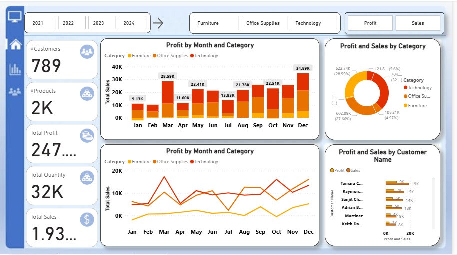

# 📊 E-Commerce Sales Dashboard | Power BI Project

## 📌 Project Overview
This project demonstrates the end-to-end Business Intelligence process using Microsoft Power BI.

It includes:
- Data cleaning and transformation using Power Query
- Data modeling using Star Schema
- Creating calculated columns and DAX measures
- KPI development
- Interactive dashboard design

---

## 📂 Dataset
The dataset contains:
- Orders
- Customers
- Products
- Categories
- Sales and Profit metrics

---

## 📈 Key KPIs
- Total Sales
- Total Profit
- Total Quantity
- Number of Customers
- Number of Products

---

## 🛠 Tools Used
- Microsoft Power BI
- Power Query
- DAX
- Data Modeling (Star Schema)
